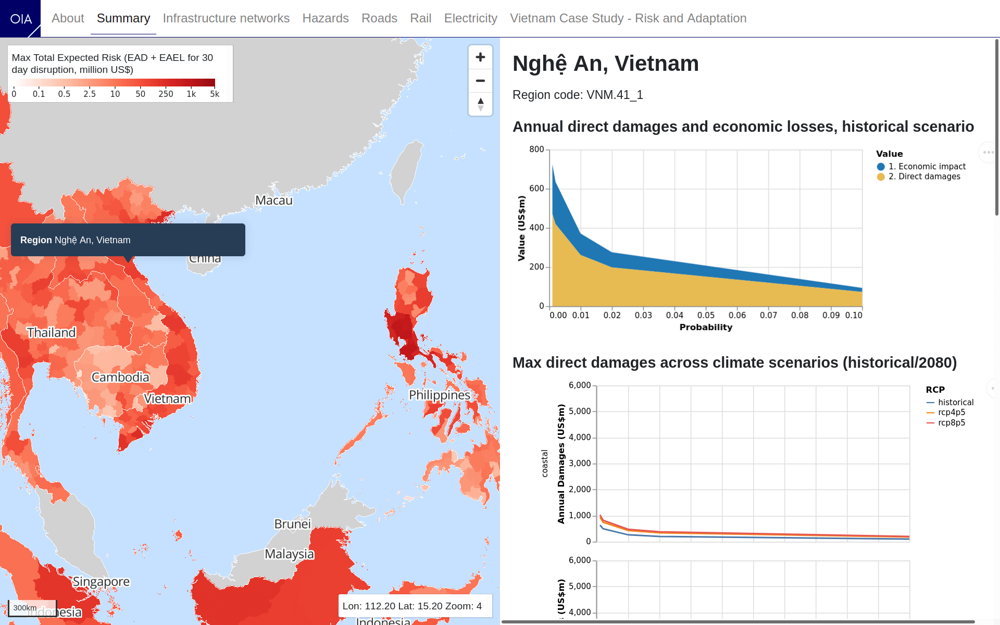
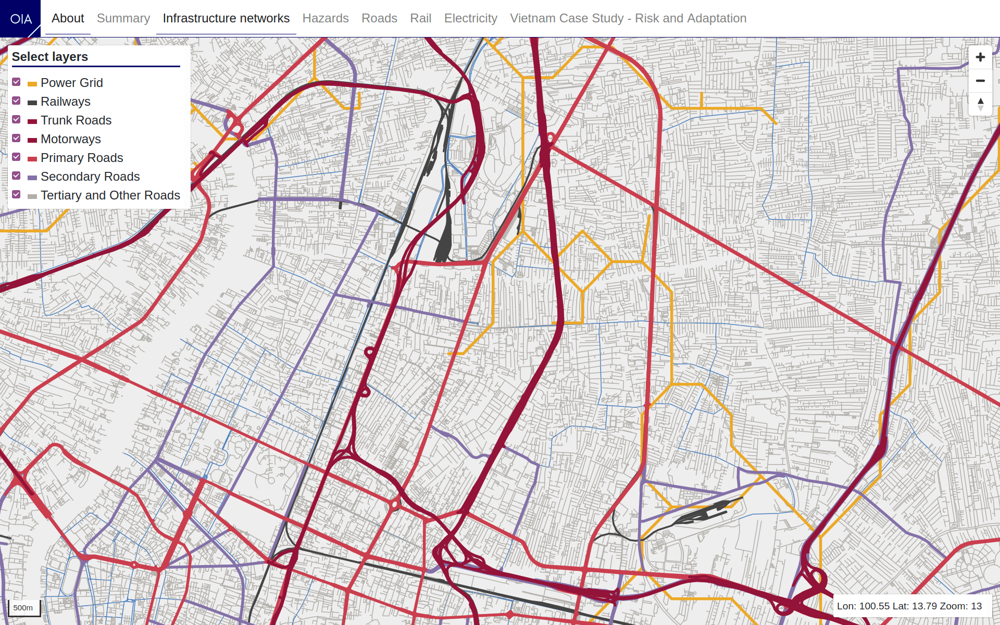
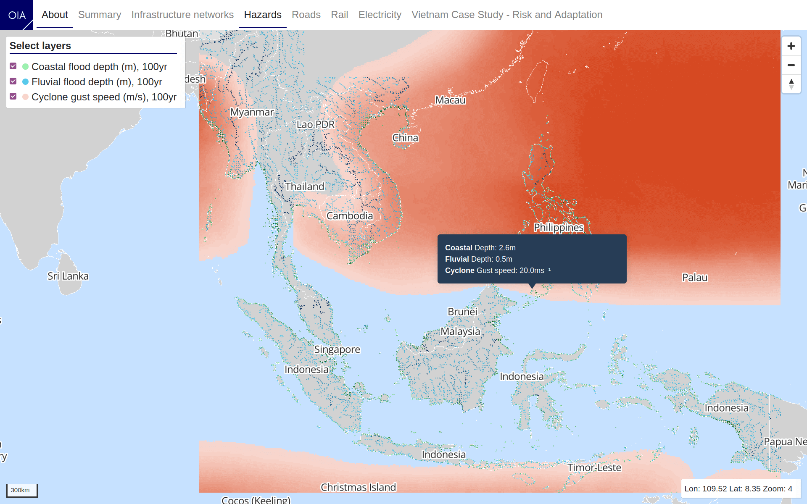
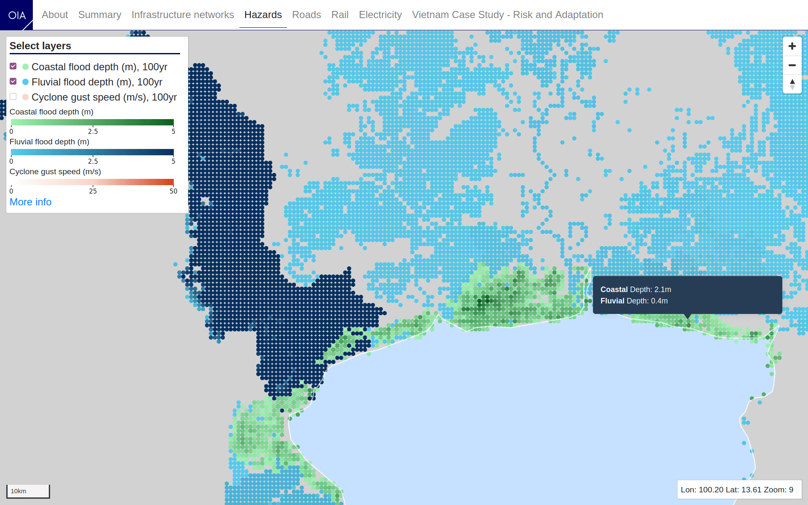
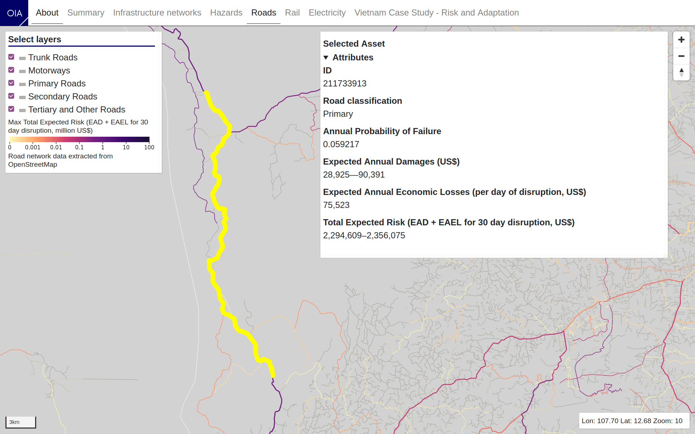
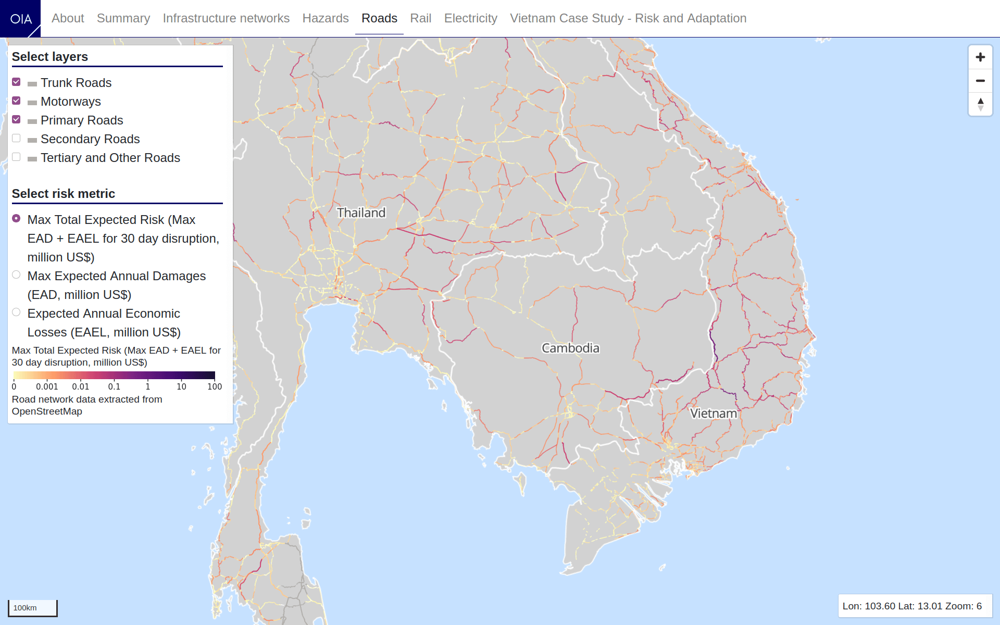
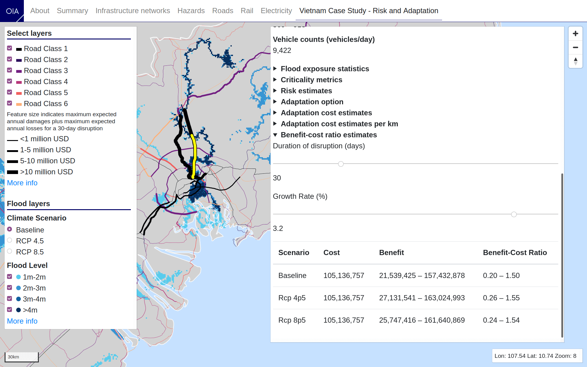

# OIA Risk Visualisation Tool

This project provides interactive data visualisations of risk analysis results.

The tool presents the infrastructure systems and hazards considered in the
analysis, then presents results as modelled for the whole system at a fine
scale.

Summarise risk analysis at an admin-1 regional scale:

See an overview of infrastructure networks:

Zoom in to see networks in detail:

See an overview of hazard data:

Inspect details of hazard layers:

Query attributes of elements of the system:

Range of potential economic impacts of failure, consisting of direct damages to
infrastructure assets and indirect economic losses resulting from infrastructure
service disruption (loss of power, loss of access):

In the Vietnam case study (and in
[version 0.1 of this tool](https://github.com/oi-analytics/oi-risk-vis/releases/tag/v0.1-argentina)
showing analysis done in Argentina), explore a cost-benefit analysis (under
uncertainty, with options to explore some parameters) of adaptation measures:

This README covers requirements and steps through how to prepare data for
visualisation and how to run the tool.

1. Data preparation requirements
2. Prepare data
3. Build and run requirements
4. Run

## Data preparation requirements

### ogr2ogr

[ogr2ogr](https://www.gdal.org/ogr2ogr.html) is used for spatial data
processing. On Ubuntu, run:

    sudo apt-get install gdal-bin

### Tippecanoe

The data preparation steps use
[Mapbox tippecanoe](https://github.com/mapbox/tippecanoe) to build vector tiles
from large feature sets.

The easiest way to install tippecanoe on OSX is with Homebrew:

    brew install tippecanoe

On Ubuntu it will usually be easiest to build from the source repository:

    sudo apt-get install build-essential g++ libsqlite3-dev zlib1g-dev
    git clone https://github.com/mapbox/tippecanoe
    cd tippecanoe
    make -j
    make

## Prepare data

This step is not necessary if you already have a prepared set MBTiles files -
the simplest option is to place them directly in the `/data` folder.

Otherwise, to prepare results of analysis for visualisation in this tool, you
will need to build a set of MBTiles files which contain the data as Mapbox
Vector Tiles for the map visualisations, and a set of CSV files for the charts.

Download `boundaries`, `network` and `flood_data` `usage` `results` from the
shared folder.

Either link to the synced/downloaded data directories:

    ln -s 'path/to/results' incoming_data/results

Or unzip within `/incoming_data` folder:

    unzip ~/Downloads/boundaries.zip -d incoming_data/
    unzip ~/Downloads/network.zip -d incoming_data/

Convert the incoming data to JSON files first:

    python scripts/files_to_json_for_vis.py

Create the *.mbtiles files for visualisation:

    make

## Build and run requirements

### Node and npm

The build and run steps use [node.js](https://nodejs.org/) - this provides the
`npm` command.

Install required packages. Run from the project root:

    npm install

## Run

Running the application currently requires two (local) server processes: the
tileserver and the app itself.

### Run the tileserver

Run the tileserver directly (from the root of the project):

    npx tileserver-gl-light

Open a browser to view the tileserver:

    firefox http://localhost:8080/

### Run the app

Start the app server:

    npm start

This should automatically open a browser tab. If not, open:

    firefox http://localhost:3000/

## Deployment

See `./deploy` directory.
